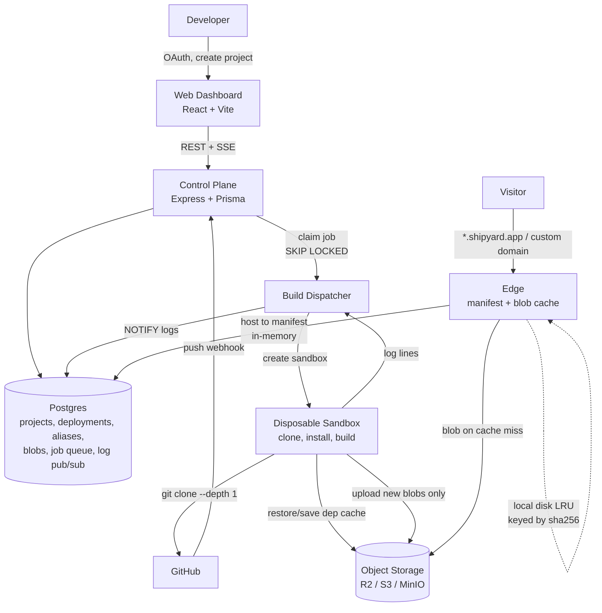

# Shipyard — Work Plan

A deployment platform for **static build output**. Connect a GitHub repo; Shipyard builds it
in a disposable sandbox, works out what directory the build wrote, and serves it on a
wildcard subdomain — for React, Vue, Svelte/SvelteKit (static adapter), Next.js
(`output: 'export'`), Astro, Nuxt, Vite, CRA, Angular, Gatsby, and plain HTML.

Status: planning. Nothing here is built yet.

---

## 1. Scope

### In scope (v1)

| Capability | Detail |
|---|---|
| Deploy from GitHub | Public repos by URL; private repos via GitHub App |
| Any npm framework | Output directory discovered by observation, not guesswork |
| Isolated builds | Each build runs in a disposable sandbox, then the sandbox dies |
| Warm dependency cache | Second build of a project skips most of `npm install` |
| Live build logs | Streamed to the dashboard over SSE |
| Immutable deployments | Every build is permanently addressable at its own URL |
| Instant rollback | Promote/rollback is one row update; no data moves |
| Preview deployments | Every branch and PR gets its own URL |
| Auto-deploy on push | GitHub webhook → build |
| Build-time env vars | Encrypted at rest, injected into the sandbox |
| Custom domains | CNAME + automatic TLS |

### Out of scope (v1)

- **SSR / serverless functions.** No Next.js server runtime, no API routes, no middleware.
  The contract is: the build emits a directory of static files. This constraint is what
  makes everything else tractable — hold the line on it.
- Non-npm toolchains (Hugo, Jekyll, Rust/WASM). The sandbox is generic; add images later.
- Workspace-aware monorepo builds beyond a configurable root directory.
- Analytics, team accounts, RBAC, billing.

### The thing to keep in mind throughout

You are running **arbitrary untrusted code from the internet** on your infrastructure.
Every isolation decision in §4 follows from that. A pipeline that shells out to
`npm install && npm run build` on a host is remote code execution as a service — not a
shortcut to clean up later.

---

## 2. Why this isn't Deploy_X's architecture

[Deploy_X](https://github.com/bharath200415/Deploy_X) is a clear, working demonstration of
the pipeline, and reading it is the fastest way to understand the problem space. But its
shape — *API clones → uploads every source file to S3 → Redis queue → worker downloads every
file → builds on the host → uploads output → router does an S3 GET per request* — has four
structural problems. They aren't polish items; each one changes what you build.

### 2.1 The source round-trip through object storage is pure overhead

Deploy_X clones the repo in `uploadService`, walks the tree, and issues one `PutObject` per
file. The worker then issues one `GetObject` per file to reconstruct it. A mid-sized repo is
thousands of round trips in each direction, and it dominates deploy latency.

**Better: the builder clones the repo itself.** Git is already a delta-compressed transfer
protocol built for exactly this. A shallow single-branch clone of a typical frontend repo is
one connection and a couple of seconds.

The only reason to stage through storage would be if the API held credentials the builder
didn't — and that's solved by minting a short-lived GitHub App installation token at build
start and passing it to the sandbox. **This deletes an entire service** and the slowest
segment of the pipeline.

### 2.2 Prefix-copy storage makes rollback expensive and dedup impossible

Deploy_X writes build output to `dist/<id>/...` — a fresh full copy of every file, per
deployment. Redeploy a site after a one-word README change and you've stored a second
complete copy of every asset. There's no way to roll back except by rebuilding, and no way
to tell that 98% of the new deployment is byte-identical to the old one.

**Better: a content-addressed store.** Hash every output file; store the bytes once at
`blobs/<sha256>`; store a per-deployment `manifest.json` mapping path → hash. Uploading a
deployment means `HEAD`-ing the hashes and uploading only the misses — in practice 2–5% of
files on a rebuild. A deployment *is* its manifest, so rollback is repointing a pointer and
moves zero bytes.

This also makes the edge cache trivially correct, which is the next problem.

### 2.3 An S3 GET per request is the wrong hot path

Deploy_X's `reqHandler` does an `s3.getObject` on every single request and buffers the whole
body into memory before responding. A page loading 30 assets is 30 round trips to object
storage, each 50–200ms, on every visit by every visitor. It also means a 40MB file is a 40MB
allocation per concurrent request.

**Better: because blobs are content-addressed and immutable, the edge can cache them on
local disk forever with no invalidation logic at all.** First request for a hash fetches and
stores it; every subsequent request across every deployment that references that hash is a
local read. Manifests are small JSON and live in memory. Responses stream.

"Immutable content means the cache is always right" is the property worth designing for, and
you only get it if you choose content addressing in §2.2.

### 2.4 `spawn('npm', ..., { shell: true })` on the worker host is RCE

Deploy_X's `buildProject` spawns the install and build directly on the worker, with a shell,
as whatever user the worker runs as, with no limits. Any repo you deploy — or anyone who can
submit a URL — gets code execution on that machine, with its environment variables and its
storage credentials.

This is the one difference that isn't a performance argument. §4 covers the replacement.

### 2.5 One more, smaller: the object key is built from user input

The object key is built as `dist/<id>` + `req.path`, concatenating a request path straight into a storage key, so
`GET /../../other-id/index.html` reads another tenant's deployment. Noted here because a
content-addressed edge sidesteps the whole class: the edge never builds a key from a request
path, it looks the path up in a manifest and uses the hash it finds. Paths that aren't in the
manifest simply don't resolve.

---

## 3. Architecture



### Services

| Service | Responsibility | Notes |
|---|---|---|
| `web` | Dashboard SPA | Static; deploys on Shipyard once it works |
| `api` | Auth, projects, deployments, webhooks, SSE, aliases | Only thing browsers talk to |
| `dispatcher` | Claims build jobs, creates/destroys sandboxes, relays logs | Thin. Holds a sandbox-API token, never a Docker socket |
| `edge` | Hostname → manifest → blob; caching, streaming | Read-heavy; must stay up while builds fail |

Note what's *absent* relative to Deploy_X: there is no upload service, because nothing stages
source through storage (§2.1).

And note that `dispatcher` is deliberately thin. Deploy_X's worker *is* the build environment;
here the dispatcher only orchestrates one, so the process that touches untrusted code and the
process that holds credentials are different processes on different machines.

### Stack

- **Frontend:** React 19, Vite, TypeScript, Tailwind, shadcn/ui, TanStack Query, React Router
- **Backend:** Node 22, Express 5, TypeScript, Zod at every boundary, Prisma
- **Data:** Postgres. See §3.1 — **no Redis in v1**.
- **Sandbox:** pluggable driver; local Docker in dev, Fly Machines or Kubernetes Jobs in prod (§4)
- **Storage:** S3-compatible — MinIO locally, Cloudflare R2 in production (zero egress fees,
  which matters when the workload is serving static assets)
- **Edge TLS:** Caddy with on-demand TLS for custom domains
- **Repo:** pnpm workspaces + Turborepo

### 3.1 Postgres only — skip Redis until it's earned

Deploy_X uses Redis for the queue (`brPop`), status (`hSet`), and logs (`rPush`). That's
three jobs, and Postgres does all three well enough that a second datastore isn't worth its
operational cost at this stage:

- **Queue:** `SELECT ... FOR UPDATE SKIP LOCKED` is a correct, well-understood job queue with
  transactional claim semantics. Deploy_X's `brPop` loop has a real failure mode it doesn't
  handle: if a worker dies mid-build, the job is gone — it was popped and never acknowledged.
  A `SKIP LOCKED` claim with a lease and a visibility timeout recovers automatically.
- **Live logs:** `LISTEN`/`NOTIFY` fans out to SSE connections.
- **Status:** it's a column.

Add Redis when you can name the measurement that demands it (queue throughput or SSE fan-out
past what one Postgres handles). Starting with one datastore instead of two is one less thing
to run, back up, and reason about during M1–M4.

### 3.2 Storage layout

```
blobs/<sha256>                    # file content, deduplicated, immutable, forever
blobs/<sha256>.br                 # brotli-precompressed variant, written at upload time
depcache/<lockfileHash>.tar.zst   # warm node_modules / package-manager store
logs/<deploymentId>.log           # build log, flushed once at completion
```

Manifests live in Postgres (`Deployment.manifest` as `jsonb`) rather than storage — they're
small, the edge queries them constantly, and having them transactional with the alias update
is what makes promotion atomic.

No source is stored at all. The commit SHA is the source of truth; a rebuild re-clones.

---

## 4. Build isolation

The build step runs untrusted code. Two things follow: the environment must be disposable,
and the process that creates it must not be the process that holds your credentials.

### 4.1 A driver interface, chosen per environment

```ts
interface SandboxDriver {
  run(spec: BuildSpec): AsyncIterable<LogLine>;  // resolves when the sandbox has exited
  cancel(handle: string): Promise<void>;
}
```

| Driver | Use | Isolation |
|---|---|---|
| `LocalDockerDriver` | Local dev only | Container. Requires a Docker socket — acceptable on your laptop, never in prod |
| `FlyMachineDriver` | **Recommended for production** | Firecracker microVM per build. Hardware-virtualized, created by API call, per-second billing, no cluster to operate |
| `K8sJobDriver` | If you already run Kubernetes | A Job per build with the gVisor `RuntimeClass`; scheduling, limits, and cleanup come free |

The recommendation is **Fly Machines**. A microVM is a genuinely stronger boundary than a
container — container escapes are a recurring class of CVE, and a kernel exploit inside a
Firecracker VM gets you a VM. Operationally it's an HTTP call to create, one to destroy, and
nothing running between builds, which for a solo-operated platform beats maintaining a pool
of privileged Docker hosts.

Keep `LocalDockerDriver` honest about what it is: dev-only, and the plan says so in code.

### 4.2 Limits, on every driver

Enforced by the sandbox where possible and by the dispatcher regardless:

```
non-root user                 memory 2g, no swap        cpus 2
read-only rootfs              pids 512                  no nested socket/API access
writable: /workspace, /tmp    wall-clock timeout 10m    output cap 500 MB
                              log-line cap 50k
```

Two deliberate calls:

- **Network stays on during install.** `npm install` needs the registry. Isolation is the
  sandbox, not the network. Hardening step later: an egress proxy allowing only the registry
  and GitHub.
- **Do not pass `--ignore-scripts`.** It breaks `esbuild`, `sharp`, `@swc/core`, Playwright —
  most real builds. Postinstall scripts are precisely the untrusted code the sandbox exists
  to contain; blocking them trades a working product for security theatre.

### 4.3 Credentials

The sandbox gets: the repo's short-lived installation token, the project's decrypted env
vars, and **an upload token scoped to writing blobs for this one deployment**. It never gets
database access, long-lived storage credentials, or the dispatcher's sandbox-API token.

### 4.4 The dependency cache

This is a day-one feature, not a stretch goal, because it's the difference between a
90-second build and a 20-second one — the single largest factor in how the product feels.

Key on `sha256(lockfile + node version + package manager)`. Restore `depcache/<key>.tar.zst`
into the workspace before install; on a hit, `npm ci` becomes a near-no-op. Save the archive
after a successful install on a miss. Content-keyed, so it's never stale — a lockfile change
is a different key.

---

## 5. Discovering the output directory

`dist` is not a safe assumption across the target frameworks. Deploy_X hardcodes it, then
falls back to uploading the entire repo when there's no `package.json`.

**Invert the usual approach: don't predict where the build writes, observe it.**

1. Snapshot the workspace tree before the build.
2. Run the build.
3. Find every `index.html` created or modified during the build window.
4. Take the shallowest such directory that is not the workspace root.

This handles custom `outDir` configs, frameworks released after you wrote the code, and the
long tail — without a detection table having to be right.

**Framework detection still exists, but for two narrower jobs:**

- **Choosing a build command** when `package.json` has no `build` script.
- **Producing good errors.** This is where it earns its keep:

  | Symptom | Message to show |
  |---|---|
  | `next` present, `.next` written, no `out` | "Next.js needs `output: 'export'` in `next.config.js` to produce a static site." |
  | `@sveltejs/kit` with `adapter-auto` | "SvelteKit needs `@sveltejs/adapter-static`." |
  | Build succeeded, no `index.html` anywhere | "Build produced no `index.html`. Set the output directory in project settings." |
  | Server bundle detected (`server/`, `.output/server`) | "This looks like an SSR build. Shipyard serves static output only." |

  Reference table for command selection: `next build`→`out`, `nuxt generate`→`.output/public`,
  SvelteKit→`build`, `astro build`→`dist`, `ng build`→`dist/<project>/browser`,
  `gatsby build`→`public`, `react-scripts build`→`build`, Vite→`dist`, no `package.json`→root.

**Package manager** comes from the lockfile: `pnpm-lock.yaml` → `pnpm install --frozen-lockfile`,
`yarn.lock` → `yarn install --immutable`, `bun.lockb` → `bun install --frozen-lockfile`,
else `npm ci` (or `npm install` with no lockfile).

Explicit project settings and an optional `shipyard.json` (`buildCommand`, `outputDirectory`,
`installCommand`, `rootDirectory`, `nodeVersion`) override everything above.

---

## 6. The edge

Resolution per request:

1. `hostname` → `deploymentId` — in-memory LRU, Postgres on miss, invalidated on alias write.
2. `deploymentId` → manifest — in-memory; manifests are small and immutable.
3. `path` → `{sha256, size, contentType}` — a map lookup. **A path not in the manifest cannot
   resolve to anything**, which is what retires §2.5's traversal bug by construction.
4. `sha256` → bytes — local disk LRU, object storage on miss. Immutable, so a hit is always
   valid and there is no invalidation path to get wrong.

Then:

- **Stream** the body. Never buffer a whole file per request.
- `Cache-Control: public, max-age=31536000, immutable` for hashed assets; `no-cache` for HTML.
  Always safe, because deployments are immutable.
- `ETag` is the blob's sha256 — free, exact, and stable across deployments. Honor
  `If-None-Match` → `304`.
- Serve the `.br` variant when `Accept-Encoding` permits.
- Directory URLs: `/about` → `/about.html` → `/about/index.html`.
- SPA fallback: unresolved path → `/index.html` at **status 200**, per-project toggle (wrong
  for a static blog, essential for client-side routing).
- Range requests for media.

### Promotion and rollback

An `Alias` row maps hostname → deployment:

- `<project>.shipyard.app` → current production
- `<project>-git-<branch>.shipyard.app` → latest build of that branch
- `<deploymentId>.shipyard.app` → that build, permanently
- `www.customer.com` → current production

Promote and rollback are both a single `UPDATE` plus a cache invalidation. No rebuild, no
copy, instant, and reversible — which only works because §2.2 made a deployment a pointer.

---

## 7. Data model

```prisma
model User        { id, githubId, login, email, avatarUrl, createdAt }
model Project     { id, userId, name, repoFullName, repoId, defaultBranch,
                    rootDirectory, installCommand?, buildCommand?, outputDirectory?,
                    nodeVersion, spaFallback: Boolean, createdAt }
model EnvVar      { id, projectId, key, valueCiphertext, target: PRODUCTION|PREVIEW|ALL }

model Deployment  { id, projectId, commitSha, commitMessage, branch,
                    trigger: MANUAL|PUSH,
                    status: QUEUED|BUILDING|UPLOADING|READY|FAILED|CANCELLED,
                    manifest: Json?,        // path -> { sha256, size, contentType }
                    detectedFramework?, resolvedOutputDir?, totalBytes?, newBytes?,
                    errorMessage?, queuedAt, startedAt, finishedAt }

model Blob        { sha256 @id, size, contentType, refCount, createdAt }
model Alias       { id, hostname @unique, projectId, deploymentId,
                    kind: PRODUCTION|BRANCH|PERMANENT|CUSTOM }
model Domain      { id, projectId, hostname @unique, verified, verificationToken }

model BuildJob    { id, deploymentId, status, attempts, leasedUntil?, leasedBy?, createdAt }
```

`Blob.refCount` is what makes garbage collection possible: deleting a deployment decrements
its manifest's blobs, and a sweep removes those that reach zero. Without a refcount, a
deduplicated store can never safely delete anything.

**Build logs are not rows.** Deploy_X keeps them in a Redis list; my first draft proposed a
row per line in Postgres, which is millions of rows of write amplification for data read once
or twice. Instead: live tail streams over `NOTIFY` while the build runs, and the complete log
is flushed once to `logs/<deploymentId>.log` at completion. The SSE endpoint replays from
that object if the build has finished, and subscribes if it hasn't.

---

## 8. API surface

```
POST   /api/auth/github/callback
GET    /api/me

POST   /api/projects                        { repoFullName, name, settings }
GET    /api/projects
GET    /api/projects/:id
PATCH  /api/projects/:id
DELETE /api/projects/:id

GET    /api/projects/:id/env
PUT    /api/projects/:id/env                encrypted at rest, never returned in plaintext

POST   /api/projects/:id/deployments        { branch? }
GET    /api/projects/:id/deployments        paginated
GET    /api/deployments/:id
POST   /api/deployments/:id/cancel
POST   /api/deployments/:id/promote
GET    /api/deployments/:id/logs            completed log
GET    /api/deployments/:id/logs/stream     SSE: replay + live tail

POST   /api/projects/:id/domains
POST   /api/domains/:id/verify
DELETE /api/domains/:id

POST   /api/webhooks/github                 HMAC-verified
```

---

## 9. Milestones

Sized for one developer. Each ends in something demonstrable.

### M0 — Foundations (2–3 days)
pnpm + Turborepo monorepo (`apps/web`, `apps/api`, `apps/dispatcher`, `apps/edge`,
`packages/shared`, `packages/db`). `docker-compose.yml`: Postgres + MinIO. Prisma schema and
first migration. Shared Zod types. Lint/format/tsconfig base. CI: typecheck, lint, test.
**Done when:** `docker compose up && pnpm dev` brings up all four services, CI green.

### M1 — Walking skeleton, right-shaped (1 week)
Paste a public repo URL → job row → dispatcher claims it with `SKIP LOCKED` → `LocalDockerDriver`
clones and builds in a container → output hashed into the blob store with a manifest → edge
resolves `<id>.localhost` through manifest and blob cache and serves it.

No auth, no detection, no cache. But **content addressing and sandboxed builds are in from the
first commit**, because those are the two things §2 says you cannot retrofit.
**Done when:** a Vite React app deploys end to end, and a second deploy of the same commit
uploads zero new blobs.

### M2 — Output discovery + framework matrix (1 week)
The observe-what-was-written mechanism from §5. Lockfile-based package manager selection.
The four diagnostic error messages. Output size cap. Fixture repo per framework.
**Done when:** React/Vite, Vue, Svelte, SvelteKit static, Next.js export, Astro, CRA, Angular
and plain HTML fixtures all deploy correctly, and a Next.js repo *without* `output: 'export'`
fails with the actionable message rather than a stack trace.

### M3 — Real sandbox + dependency cache (1 week)
Implement `FlyMachineDriver` behind the §4.1 interface. Every limit from §4.2. Scoped
per-deployment upload tokens. The §4.4 dependency cache. Cancellation. Lease expiry and
automatic requeue.
**Done when:** a fixture whose build script attempts `rm -rf /`, a fork bomb, and reading the
dispatcher's environment fails safely with the host untouched — **and** the second build of a
project is measurably faster than the first.

### M4 — Logs + dashboard lifecycle (1 week)
`NOTIFY`-backed SSE with replay from the flushed log object. Deploy form, deployment list with
status badges, terminal-style console with autoscroll, detail page, cancel.
**Done when:** you can watch a build stream live, cancel mid-flight, and reload a finished
build to see its complete log.

### M5 — Auth + GitHub App + auto-deploy (1 week)
GitHub OAuth login. GitHub App install, repo listing, short-lived installation tokens for
private clones. Project CRUD with setting overrides. Encrypted env vars. HMAC-verified push
webhook → build.
**Done when:** `git push` to a connected private repo produces a deployment with no UI
interaction.

### M6 — Aliases, previews, rollback, domains (1 week)
Alias kinds and the edge's hostname cache. Promote and rollback buttons. PR preview URLs
commented back to the PR. Custom domains with CNAME verification and Caddy on-demand TLS.
**Done when:** you roll production back one click and serve a real domain over HTTPS.

### M7 — Operations (1 week)
Rate limits (deploys/hour, concurrent builds/user). Blob GC via `refCount`. Retention for
logs and unaliased deployments. Structured logging, metrics (queue depth, build duration,
cache hit rate, blob dedup ratio, p95 edge latency), Sentry. Graceful shutdown returning
leases. Orphaned-sandbox reaper. Health/readiness endpoints.
**Done when:** you kill the dispatcher mid-build and the job completes after restart.

### M8 — Production (3–4 days)
`api` and `edge` on small VMs or Fly, Postgres managed, storage on R2, builds on Fly Machines.
Wildcard DNS and TLS for `*.shipyard.app`. Runbook. Then **deploy the dashboard on Shipyard
itself** — the real acceptance test.

**Total: roughly 7–8 weeks solo.** M1 and M3 carry the risk.

---

## 10. Risks

| Risk | Mitigation |
|---|---|
| Sandbox escape | microVM per build; non-root, cap-drop, read-only, no nested socket; scoped per-build credentials only |
| Free builds used for crypto mining | Hard timeouts, CPU caps, per-user concurrency limit, deploys/hour rate limit |
| Blob store grows forever | `refCount` + GC sweep (M7); dedup already cuts the growth rate hard |
| Dependency cache poisoning | Key includes the lockfile hash; cache is per-project, never shared across projects |
| Output discovery picks the wrong directory | Shallowest-`index.html`-written-during-build heuristic, plus explicit override, plus a clear failure — never a silent wrong deploy |
| Job lost when dispatcher dies | Lease + visibility timeout; job state is a transactional Postgres row |
| Edge cold-start latency | Local blob LRU warms fast; optional CDN in front |
| Malicious site on your domain | Abuse reporting and takedown path; keep user content on a domain separate from the dashboard's |

---

## 11. Testing

- **Unit:** output-discovery against recorded before/after filesystem trees (cheap, catches
  most regressions); manifest resolution including paths that aren't in the manifest.
- **Integration:** API + Postgres + MinIO via Testcontainers; full deploy lifecycle; verify
  the second identical deploy uploads zero blobs.
- **E2E fixtures:** one minimal repo per supported framework under `fixtures/`, deployed
  nightly in CI. This is the regression net for the product.
- **Security:** `fixtures/malicious/` attempting host writes, credential exfiltration, and a
  fork bomb. Must fail cleanly. Runs in CI.
- **Load:** k6 against the edge, measuring blob cache hit rate under realistic asset mixes.

---

## 12. Later

Build-cache beyond dependencies (framework build caches keyed on source hash), `_headers` and
`_redirects` support, password-protected deployments, Slack/Discord notifications, monorepo
workspace detection, GitLab/Bitbucket sources, other runtimes via alternative sandbox images,
and — only if the static-only constraint is ever relaxed — SSR, which is a second platform.

---

## 13. Credits

[Deploy_X](https://github.com/bharath200415/Deploy_X) by
[@bharath200415](https://github.com/bharath200415) is a clear working demonstration of the
build-and-serve pipeline and the fastest way to understand the problem. §2 explains where
Shipyard takes a different path and why.
