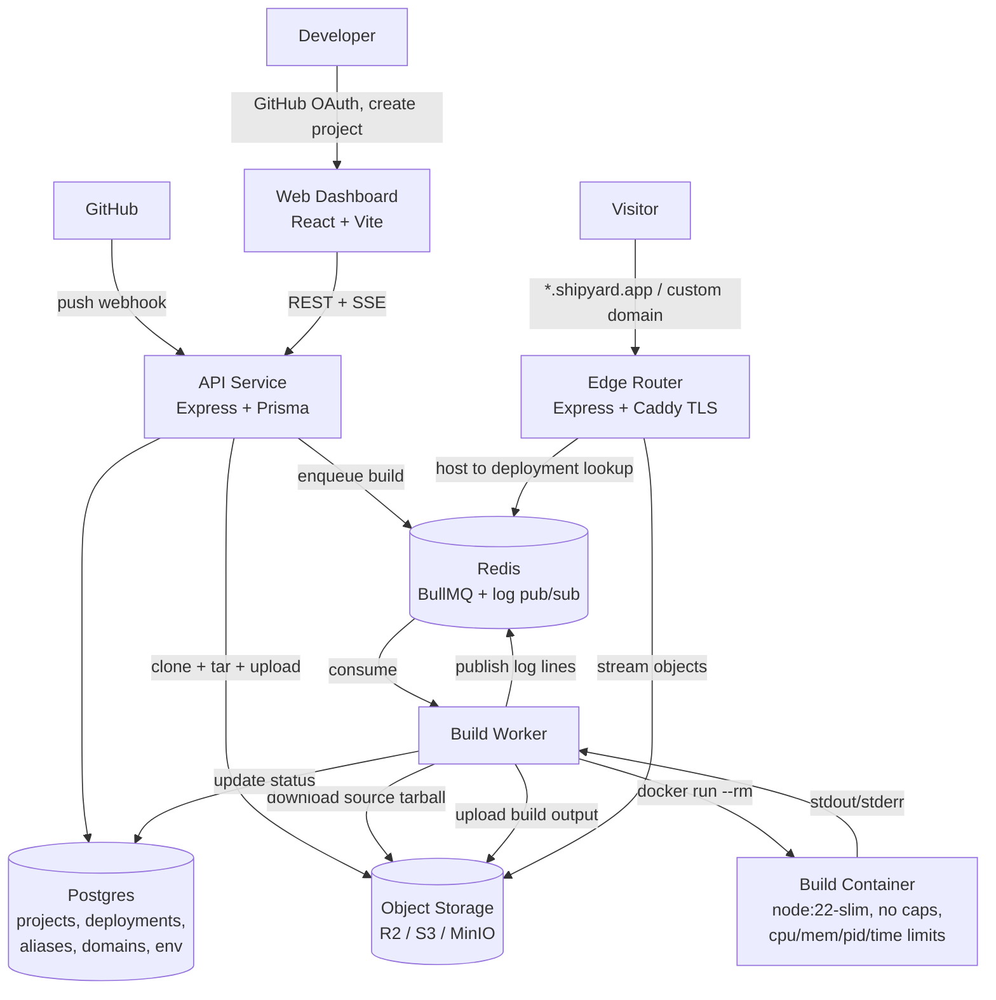

# Shipyard — Work Plan

A Vercel-inspired deployment platform for **static build output**. Point it at a GitHub
repo; it clones, installs, runs `npm run build`, detects the output directory, uploads the
artifacts to object storage, and serves them on a wildcard subdomain — for React, Vue,
Svelte/SvelteKit (static adapter), Next.js (`output: 'export'`), Astro, Nuxt (generate),
Vite, CRA, Angular, Gatsby, and plain HTML.

Status: planning. Nothing in this document is built yet.

---

## 1. Scope

### In scope (v1)

| Capability | Detail |
|---|---|
| Deploy from GitHub | Public repos by URL; private repos via GitHub App |
| Any npm framework | Auto-detect build command + output dir; manual override |
| Isolated builds | Each build runs in a throwaway Docker container |
| Live build logs | Streamed to the dashboard over SSE |
| Immutable deployments | Every build is permanently addressable at its own URL |
| Aliases & rollback | Promote/rollback = repoint an alias, no rebuild |
| Preview deployments | Every branch and PR gets its own URL |
| Auto-deploy on push | GitHub webhook → build |
| Build-time env vars | Encrypted at rest, injected into the build container |
| Custom domains | CNAME + automatic TLS |

### Explicitly out of scope (v1)

- **SSR / serverless functions.** No Next.js server runtime, no API routes, no edge
  middleware. The contract is: `npm run build` produces a directory of static files.
  This single constraint is what makes the whole system tractable — hold the line on it.
- Non-npm ecosystems (Hugo, Jekyll, Rust/WASM toolchains). Easy to add later; the build
  container is already generic.
- Monorepo workspace-aware builds beyond a configurable root directory.
- Analytics, team accounts, RBAC, billing.

### Non-goals worth stating out loud

You are running **arbitrary untrusted code from the internet** on your infrastructure.
Everything in §3.2 exists because of that. A build pipeline that shells out to
`npm install && npm run build` on the host is remote code execution as a service. Do not
ship that, even to yourself, even "just for the demo."

---

## 2. Architecture



### Services

| Service | Responsibility | Why separate |
|---|---|---|
| `web` | Dashboard SPA | Static; deploys on Shipyard itself once it works |
| `api` | Auth, projects, deployments, webhooks, log SSE, source ingest | The only thing users' browsers talk to |
| `worker` | Consumes build jobs, drives Docker, uploads artifacts | Scales horizontally; lives on hosts you're willing to see compromised |
| `edge` | Resolves hostname → deployment, streams files, caching | Different scaling profile (read-heavy, latency-sensitive) and must stay up while builds fail |

**Do not merge `worker` into `api`.** The worker needs Docker daemon access, which is
root-equivalent. Keeping it on its own machine is the entire security boundary.

### Stack

- **Frontend:** React 19, Vite, TypeScript, Tailwind, shadcn/ui, TanStack Query, React Router
- **Backend:** Node 22, Express 5, TypeScript, Zod (validate every boundary), Prisma
- **Data:** Postgres (durable state), Redis (queue + log fan-out + hostname cache)
- **Queue:** BullMQ — retries, backoff, concurrency limits, dead-letter, job TTL. Raw
  `brPop` loops lose jobs when a worker dies mid-build; do not hand-roll this.
- **Builds:** Docker via `dockerode`
- **Storage:** S3-compatible — MinIO locally, Cloudflare R2 in production (zero egress fees,
  which matters a lot when you're serving static assets)
- **Edge TLS:** Caddy in front of `edge`, on-demand TLS for custom domains
- **Repo:** pnpm workspaces + Turborepo monorepo

---

## 3. The four problems that actually matter

Everything else is CRUD. These are the parts to get right.

### 3.1 Finding the build output directory

`dist` is not a safe assumption. The resolution order:

1. **Explicit project setting.** User-configured output directory always wins.
2. **`shipyard.json` in the repo** (optional): `{ "buildCommand", "outputDirectory", "installCommand", "rootDirectory", "nodeVersion" }`.
3. **Framework detection** from `package.json` dependencies and config files:

   | Detected | Build command | Output |
   |---|---|---|
   | `next` | `next build` | `out` — **requires `output: 'export'`** |
   | `nuxt` | `nuxt generate` | `.output/public` |
   | `@sveltejs/kit` | `vite build` | `build` — **requires `adapter-static`** |
   | `astro` | `astro build` | `dist` |
   | `@angular/cli` | `ng build` | `dist/<project>/browser` |
   | `gatsby` | `gatsby build` | `public` |
   | `react-scripts` (CRA) | `react-scripts build` | `build` |
   | `@vue/cli-service` | `vue-cli-service build` | `dist` |
   | `@remix-run/*` (SPA mode) | `remix vite:build` | `build/client` |
   | `vite` (React/Vue/Svelte/Solid/Qwik) | `vite build` | `dist` |
   | no `package.json` | — | repo root, served as-is |

4. **Post-build heuristic fallback.** Record directory mtimes before the build. After it,
   pick the first of `dist`, `build`, `out`, `public`, `.output/public`, `_site` that
   (a) exists, (b) contains an `index.html`, and (c) was created or modified during the
   build. This catches the long tail of custom configs, and it's more reliable than
   detection alone.

If nothing is found, **fail loudly with a log line telling the user to set the output
directory**. Never silently deploy the repo root.

**Two framework-specific traps to surface in the UI as an actionable error, not a stack trace:**
- Next.js without `output: 'export'` produces `.next`, not `out`. Detect `.next` with no
  `out` and say exactly that.
- SvelteKit with the default `adapter-auto` fails or emits a server bundle. Detect and say so.

**Package manager** comes from the lockfile: `pnpm-lock.yaml` → `pnpm install --frozen-lockfile`,
`yarn.lock` → `yarn install --immutable`, `bun.lockb` → `bun install --frozen-lockfile`,
otherwise `npm ci` (falling back to `npm install` when there's no lockfile).

### 3.2 Build isolation

Every build runs as `docker run --rm` with:

```
--user 1000:1000                 # never root
--read-only                      # rootfs immutable
--tmpfs /tmp:size=512m
-v <build-dir>:/workspace        # the only writable path
--memory 2g --memory-swap 2g
--cpus 2
--pids-limit 512
--security-opt no-new-privileges
--cap-drop ALL
```

Plus, enforced by the worker: a **hard wall-clock timeout** (10 min default) that kills the
container, a **log-line cap** (say 50k lines) so a runaway build can't fill Redis, and an
**output size cap** (say 500 MB) checked before upload.

Deliberate decisions:

- **Network stays on during install.** `npm install` needs the registry. The isolation story
  is the container, not the network. A hardening step later is an egress proxy that only
  allows the registry and GitHub.
- **Do not pass `--ignore-scripts`.** It breaks `esbuild`, `sharp`, `@swc/core`, Playwright
  and more — most real builds. Postinstall scripts are exactly the untrusted code the
  container exists to contain.
- **Never mount `/var/run/docker.sock` into the build container.** That is a one-line
  container escape to host root.
- The worker itself holds Docker access, so treat worker hosts as untrusted: no production
  credentials in their environment beyond a **scoped, write-only-to-its-own-prefix** storage
  token, separate VPC/subnet, no database access.
- Later hardening: swap the runtime for **gVisor (`runsc`)** or **Firecracker** microVMs.
  Design the worker so the runtime is one config value.

### 3.3 Immutable deployments and atomic promotion

This is the design idea that separates a real platform from a toy, and it costs almost
nothing to build in from day one.

- Every build uploads to `sites/<deploymentId>/...` and is **never mutated again**.
- An `aliases` table maps hostname → deploymentId:
  - `<project>.shipyard.app` → current production deployment
  - `<project>-git-<branch>.shipyard.app` → latest build of that branch
  - `<deploymentId>.shipyard.app` → that build, forever
  - `www.customer.com` → current production deployment
- **Promote** = update one row. **Rollback** = point the row at an older deployment.
  Both are instant, atomic, and require no rebuild.
- The edge resolves hostname → deploymentId from a **Redis cache** (`alias:<host>`), with
  Postgres as the source of truth on a cache miss. Alias writes invalidate the key.

Without this you end up overwriting a live directory in-place during upload, which means
visitors see a half-deployed site, and rollback means rebuilding an old commit.

### 3.4 The edge router

The reference implementation builds its object key as `dist/<id>` + `req.path` — concatenating a
user-controlled path into an object key. `GET /../../other-id/index.html` reads another
tenant's files. Get this right:

```ts
const rel = path.posix.normalize(decodeURIComponent(reqPath));
if (rel.includes('..') || rel.includes('\0')) return res.sendStatus(400);
const key = `sites/${deploymentId}${rel.startsWith('/') ? rel : '/' + rel}`;
```

Also required:
- **Stream** the S3 body to the response. Don't `res.send(buffer)` — a 40 MB video buffers
  entirely into memory per request.
- **Caching:** content-hashed assets (`/assets/*`, `/_next/static/*`) get
  `Cache-Control: public, max-age=31536000, immutable`; `*.html` gets `no-cache`. Since
  deployments are immutable, the aggressive caching is always safe.
- **Conditional GETs:** pass through S3's `ETag` and honor `If-None-Match` → `304`.
- **Directory URLs:** `/about` → try `/about.html`, then `/about/index.html`.
- **SPA fallback:** on 404, serve `/index.html` with **status 200** (per-project toggle —
  wrong for a static blog, essential for client-side routing).
- **Range requests** for media.
- Security headers, and a per-deployment `_headers`/`_redirects` file parser as a stretch goal.

---

## 4. Data model

```prisma
model User        { id, githubId, login, email, avatarUrl, createdAt }
model Project     { id, userId, name, repoFullName, repoId, defaultBranch,
                    rootDirectory, installCommand?, buildCommand?, outputDirectory?,
                    nodeVersion, spaFallback: Boolean, createdAt }
model EnvVar      { id, projectId, key, valueCiphertext, target: PRODUCTION|PREVIEW|ALL }
model Deployment  { id, projectId, commitSha, commitMessage, branch, trigger: MANUAL|PUSH,
                    status: QUEUED|BUILDING|UPLOADING|READY|FAILED|CANCELLED,
                    detectedFramework?, resolvedOutputDir?, sizeBytes?,
                    errorMessage?, queuedAt, startedAt, finishedAt }
model BuildLog    { id, deploymentId, seq, stream: STDOUT|STDERR|SYSTEM, text, at }
model Alias       { id, hostname @unique, projectId, deploymentId, kind: PRODUCTION|BRANCH|PERMANENT|CUSTOM }
model Domain      { id, projectId, hostname @unique, verified, verificationToken, createdAt }
```

**Storage layout:**

```
sources/<deploymentId>.tar.gz      # source snapshot, retained ~7 days
sites/<deploymentId>/...           # built output, immutable
```

Upload the source as **one tarball**, not thousands of individual objects. The reference
implementation does a per-file `PutObject` for every file in the repo and then a per-file
`GetObject` in the worker; on a real project that's tens of thousands of round trips and
dominates deploy time. One tarball up, one tarball down.

Build output does need per-file objects (the edge serves them individually), so upload those
with a bounded concurrency pool (~32) and correct `Content-Type` per extension.

---

## 5. API surface

```
POST   /api/auth/github/callback     GitHub OAuth exchange
GET    /api/me

POST   /api/projects                 { repoFullName, name, settings }
GET    /api/projects
GET    /api/projects/:id
PATCH  /api/projects/:id             build settings
DELETE /api/projects/:id

GET    /api/projects/:id/env
PUT    /api/projects/:id/env         upsert (encrypted at rest, never returned in plaintext)

POST   /api/projects/:id/deployments        trigger a build { branch? }
GET    /api/projects/:id/deployments        paginated
GET    /api/deployments/:id
POST   /api/deployments/:id/cancel
POST   /api/deployments/:id/promote         production alias -> this deployment
GET    /api/deployments/:id/logs            replay persisted logs
GET    /api/deployments/:id/logs/stream     SSE: replay + live tail

POST   /api/projects/:id/domains
POST   /api/domains/:id/verify
DELETE /api/domains/:id

POST   /api/webhooks/github          HMAC-verified push events
```

**Log streaming:** the worker publishes each line to a Redis channel *and* batch-inserts it
into Postgres. The SSE endpoint replays persisted lines from Postgres, then subscribes to the
channel for the live tail. This gives you both a live console and permanent build logs.
(The reference polls `GET /logs` and returns the entire list every time — fine for a demo,
but it re-sends the whole buffer on every poll.)

---

## 6. Milestones

Sized for one developer. Each milestone ends in something demonstrable.

### M0 — Foundations (2–3 days)
pnpm + Turborepo monorepo (`apps/web`, `apps/api`, `apps/worker`, `apps/edge`,
`packages/shared`, `packages/db`). `docker-compose.yml` with Postgres, Redis, MinIO. Prisma
schema + first migration. Shared Zod types. ESLint/Prettier/tsconfig base. CI: typecheck,
lint, test on every PR.
**Done when:** `docker compose up && pnpm dev` brings up all four services and CI is green.

### M1 — Walking skeleton (1 week)
Paste a public repo URL → API clones (`--depth 1`) → tars → uploads to MinIO → enqueues →
worker downloads, runs `npm ci && npm run build` **on the host** (temporarily), uploads
`dist/` → edge serves it at `<id>.localhost:3001`. No auth, no containers, no detection.
**Done when:** a Vite React app deploys end to end and loads in a browser.
*This is the milestone that proves the wiring. Don't gold-plate it.*

### M2 — Containerized builds + framework detection (1 week)
Move builds into Docker with every limit from §3.2. Implement detection (§3.1) including
the post-build heuristic, lockfile-based package manager selection, the Next.js/SvelteKit
error messages, and the output size cap.
**Done when:** a fixture repo per framework — React/Vite, Vue, Svelte, SvelteKit static,
Next.js export, Astro, CRA, plain HTML — deploys correctly, **and** a fixture whose build
script contains `rm -rf /` or a fork bomb fails safely without touching the host.

### M3 — Real-time logs + lifecycle UI (1 week)
BullMQ with retries and a dead-letter queue. SSE log streaming with persistence. Dashboard:
deploy form, deployment list with status badges, terminal-style log console with autoscroll,
deployment detail page, cancel button. Status transitions and timing captured in Postgres.
**Done when:** you can watch a build stream live, cancel it mid-flight, and reload the page
to see the complete logs of a finished build.

### M4 — Auth, projects, auto-deploy (1 week)
GitHub OAuth login. GitHub App install for repo listing and private-repo clone tokens.
Project CRUD with build setting overrides. Encrypted env vars injected into the build
container. Push webhook (HMAC-verified) → automatic build of the pushed branch.
**Done when:** `git push` to a connected repo produces a deployment with no UI interaction.

### M5 — Aliases, previews, rollback, custom domains (1 week)
Alias table + Redis hostname cache. Production / branch / permanent alias kinds. Promote and
rollback buttons. PR preview URLs commented back onto the PR. Custom domains with CNAME
verification and Caddy on-demand TLS.
**Done when:** you can roll back production in one click and serve a real domain over HTTPS.

### M6 — Hardening and operations (1 week)
Rate limits (deploys per user per hour, concurrent builds per user). Retention job: delete
source tarballs after 7 days, prune non-aliased deployments after 30. Structured logging,
Prometheus metrics (queue depth, build duration, success rate, p95 edge latency), Sentry.
Graceful worker shutdown that requeues in-flight jobs. Orphaned-container reaper. Health and
readiness endpoints.
**Done when:** you can kill a worker mid-build and the job completes on another one.

### M7 — Production (3–4 days)
Deploy `api`/`edge` on a small VM or Fly.io, workers on a dedicated isolated host, Postgres
and Redis managed, storage on R2. Wildcard DNS `*.shipyard.app` + wildcard TLS. Runbook.
Then **deploy the dashboard on Shipyard itself** — that's the real acceptance test.

**Total: roughly 6–7 weeks solo.** M1 and M2 carry the risk; the rest is mostly known work.

---

## 7. Risk register

| Risk | Mitigation |
|---|---|
| Build container escape | Non-root, cap-drop, read-only, no docker socket, isolated worker hosts; gVisor later |
| Crypto-mining via free builds | Hard timeouts, CPU limits, per-user concurrency caps, deploys/hour rate limit |
| Storage cost from abandoned deployments | Retention job from M6; count it in the size cap |
| Framework detection misses a stack | Post-build heuristic + explicit override + a clear error, never a silent wrong deploy |
| Redis loses queued jobs | BullMQ with persistence; job state also written to Postgres so it's recoverable |
| A malicious repo serves phishing on your domain | Abuse reporting, takedown path, and keep user content on a domain separate from the dashboard's |
| Huge repos / huge outputs | Shallow clone, source and output size caps, streaming uploads |
| Cold edge latency on first request | Redis alias cache; optionally a CDN in front of `edge` |

---

## 8. Testing

- **Unit:** framework detection against a table of fixture `package.json` files (cheap, high
  value, catches most regressions); path normalization in the edge router with an explicit
  traversal-attack suite.
- **Integration:** API + Postgres + Redis + MinIO via Testcontainers; full deploy lifecycle.
- **E2E fixture repos:** one minimal repo per supported framework, committed under
  `fixtures/`, deployed in CI nightly. This is the regression net for the whole product.
- **Security:** a `fixtures/malicious/` repo whose build script attempts host writes, socket
  access, and a fork bomb. It must fail cleanly. Run it in CI.
- **Load:** k6 against the edge to size the object-storage read path.

---

## 9. Stretch goals

Build-cache restore across deploys (keyed on lockfile hash — the single biggest win on
build time), `_headers`/`_redirects` support, deploy-time password protection, Slack/Discord
notifications, monorepo workspace detection, GitLab/Bitbucket sources, other runtimes
(Python/Go/Hugo) via alternative build images, and — if you ever relax the static-only
constraint — SSR on a container runtime, which is a whole second platform.

---

## 10. Credits

Architecture informed by [Deploy_X](https://github.com/bharath200415/Deploy_X) by
[@bharath200415](https://github.com/bharath200415), which demonstrates the core
upload → queue → build → serve pipeline. Shipyard's departures from it — containerized
builds, framework detection, tarball source transfer, immutable deployments with aliases,
path-traversal-safe routing, and Postgres-backed state — are noted inline above.
